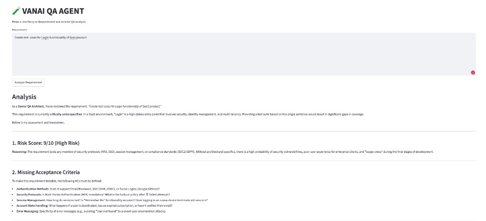
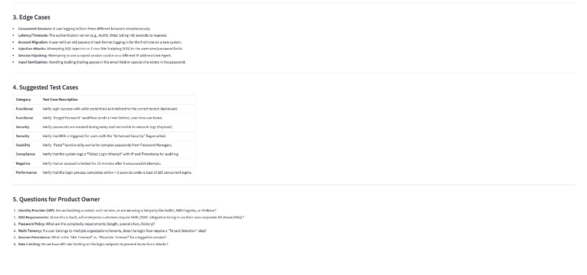

# VANAI QA AGENT

A Streamlit web app that reviews software requirements (e.g. Jira stories) using Google Gemini and returns structured QA feedback.

Paste a requirement, click **Analyze Requirement**, and get a risk score, missing acceptance criteria, edge cases, suggested test cases, and questions for the product owner.

## Screenshots

**Input & risk analysis**



**Edge cases, test cases, and PO questions**



## Features

- Web UI built with Streamlit
- AI-powered QA review via Google Gemini (`gemini-3-flash-preview`)
- Editable prompt template in `prompts/qa_review_prompt.txt`
- API key loaded from `.env` (not committed to git)

## Project Structure

```
vanai-qa-agent/
├── app.py                      # Streamlit UI
├── screenshots/                # README screenshots
├── services/
│   └── llm_service.py          # Gemini client and analyze_requirement()
├── prompts/
│   └── qa_review_prompt.txt    # QA review prompt template
├── requirements.txt
├── .env                        # GEMINI_API_KEY (create locally)
└── README.md
```

## Prerequisites

- Python 3.9+
- A [Google Gemini API key](https://aistudio.google.com/apikey)

## Setup

1. **Clone the repository**

   ```bash
   git clone <repository-url>
   cd vanai-qa-agent
   ```

2. **Create and activate a virtual environment**

   ```bash
   python3 -m venv venv
   source venv/bin/activate
   ```

3. **Install dependencies**

   ```bash
   pip install -r requirements.txt
   ```

4. **Configure environment variables**

   Create a `.env` file in the project root:

   ```env
   GEMINI_API_KEY=your_api_key_here
   ```

## Run

```bash
source venv/bin/activate
streamlit run app.py
```

The app opens in your browser (default: `http://localhost:8501`).

## How It Works

1. The user enters a requirement in the Streamlit text area.
2. `app.py` calls `analyze_requirement()` from `services/llm_service.py`.
3. The service loads the prompt template from `prompts/qa_review_prompt.txt`, inserts the requirement, and sends it to Gemini.
4. The model response is rendered as markdown in the UI.

## QA Analysis Output

The prompt asks Gemini to act as a Senior QA Architect and return:

1. **Risk Score** (1–10)
2. **Missing Acceptance Criteria**
3. **Edge Cases**
4. **Suggested Test Cases**
5. **Questions for Product Owner**

To change the review style or output sections, edit `prompts/qa_review_prompt.txt`. The `{requirement}` placeholder is required.

## Dependencies

| Package | Purpose |
|---------|---------|
| `streamlit` | Web UI |
| `google-generativeai` | Gemini API client |
| `python-dotenv` | Load `GEMINI_API_KEY` from `.env` |

## Troubleshooting

| Issue | Fix |
|-------|-----|
| `command not found: streamlit` | Activate the venv: `source venv/bin/activate`, or run `./venv/bin/streamlit run app.py` |
| `No module named 'google.generativeai'` | Run `pip install -r requirements.txt` inside the activated venv |
| API errors | Verify `GEMINI_API_KEY` in `.env` and restart Streamlit |


